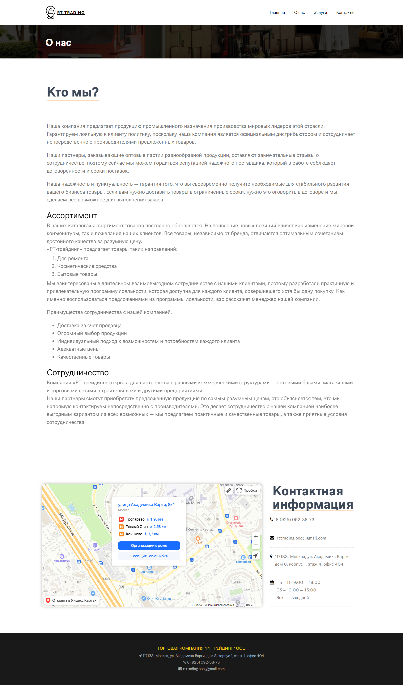

# RtTrading
---
___Описание___
RtTrading - это pet проект, который я разработал для повышения навыков в верстке, адаптации верстки под различные устройства, закрепления навыков в создания js скриптов, закрепление навыков шаблонизации php.
___Реализации___
* Верстка современного дизайна сайта
* Адаптация сайта под различные устройства
* Динамисная верстка
* Реализация динамичного появления элементов верстки с помошью JavaScript
* Реализация шаблонизации php
* Реализация проверки полей с помошью регулярных выражений и маски полей ввода
* Реализация отправки сообщения на почту с помощью асинхронных запросов ajax

---
___Скриншоты___ 
Главная страница

 

Станица "О компании"

 